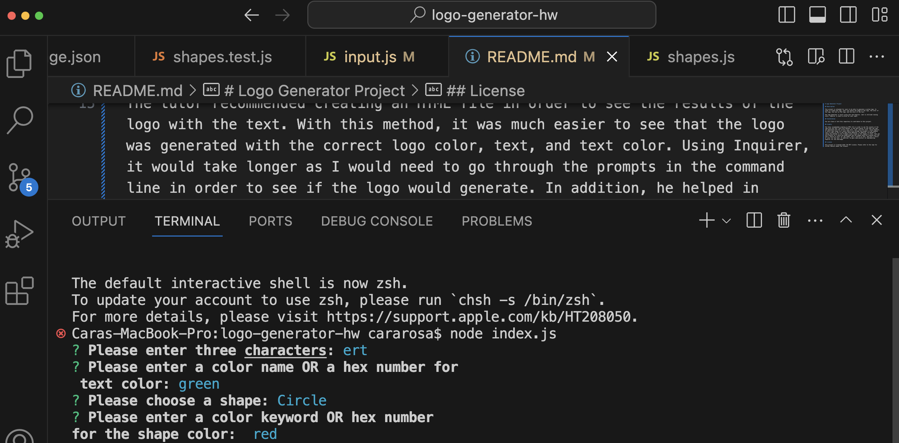

# Logo Generator Project

## Description

This project is intended for users to be able to generate a custom logo. In order to create the logo, users can choose the shape of the logo, the color of the logo, the text on the logo, and the color of the text.

The logo generator is built using Jest and Inquirer. Jest is utilized running tests. Inquirer is used to allow for user input.

## Installation

You can clone or fork this repository to contribute to this project.

## Credits

The tutor recommended creating an HTML file in order to see the results of the logo with the text. With this method, it was much easier to see that the logo was generated with the correct logo color, text, and text color. Using Inquirer, it would take longer as I would need to go through the prompts in the command line in order to see if the logo would generate. In addition, he helped in coding the methods in the Triangle class (found in the shapes.js file). This was very helpful as I could now understand how the shapes would be created with the user's choice of color for the shape, user's choice of text, and user's choice of color for the text. In addition, he gave some pointers on implementing Inquirer for the challenge.

## License

This project is licensed under the MIT License. Please refer to the repo for further details about the license.